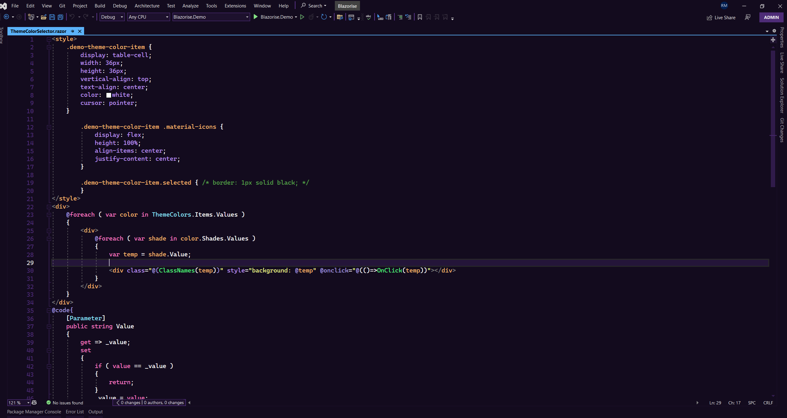

# Midnight Purple 2077 Theme

A neon-purple dark theme for Visual Studio, inspired by Midnight Purple 2077 and tuned for late-night coding.



## Compatibility

| Visual Studio | Version range | Architecture |
| --- | --- | --- |
| Visual Studio 2022 | 17.x | AMD64, ARM64 |
| Visual Studio 2026 | 18.x | AMD64, ARM64 |

The VSIX manifest intentionally targets `[17.0,19.0)` so the package supports Visual Studio 2022 and Visual Studio 2026 without claiming compatibility with future major versions that have not been tested.

Visual Studio 2026 uses Fluent `Shell` and `ShellInternal` color tokens for the IDE chrome. This package includes the official minimal dark-theme starter set for those tokens, appended after the legacy categories as Microsoft recommends, while Visual Studio 2022 continues to use the existing legacy theme tokens.

## Install

Once published, install the theme from Visual Studio Marketplace.

For local testing, build the project and open:

```text
bin\Release\MidnightPurple2077Theme.vsix
```

Then restart Visual Studio and select the theme from:

```text
Tools > Theme > Midnight Purple 2077
```

## Build

Requirements:

- Visual Studio 2022 or Visual Studio 2026
- Visual Studio extension development workload
- .NET Framework 4.7.2 targeting pack

Open `MidnightPurple2077Theme.sln` in Visual Studio, then build `Release`.

Command line:

```powershell
dotnet msbuild MidnightPurple2077Theme.csproj /restore /p:Configuration=Release /p:Platform=AnyCPU /p:DeployExtension=false
```

The packaged theme is created at:

```text
bin\Release\MidnightPurple2077Theme.vsix
```

## Publish From Terminal

Visual Studio Marketplace can be updated from the command line with `VsixPublisher.exe`.

Create a Visual Studio Marketplace/Azure DevOps PAT with Marketplace management permission, then run:

```powershell
.\scripts\Publish-Marketplace.ps1 -PersonalAccessToken "<PAT>"
```

The script clean-builds `Release`, finds `VsixPublisher.exe`, and publishes:

```text
bin\Release\MidnightPurple2077Theme.vsix
```

You can also login once and omit the PAT:

```powershell
VsixPublisher.exe login -publisherName "Marcelino-Jorge-Romero" -personalAccessToken "<PAT>"
.\scripts\Publish-Marketplace.ps1
```

To validate the build and command setup without publishing:

```powershell
.\scripts\Publish-Marketplace.ps1 -WhatIf
```

The command-line publish manifest uses the existing Marketplace internal name:

```text
Marcelino-Jorge-Romero.midnight-purple-2077-theme
```

Note: `VsixPublisher.exe` supports command-line categories such as `coding`, but not always the Marketplace UI's `Themes` category. If the Marketplace category changes after a CLI upload, restore `Themes` once from the web UI.

## Package Contents

The VSIX contains only the theme `.pkgdef`, marketplace icon, 200x200 preview image, license, and release notes. It does not include telemetry, network calls, commands, tool windows, or a runtime extension assembly. The `.pkgdef` carries the legacy Visual Studio 2022 color categories plus the conservative Visual Studio 2026 Fluent shell starter categories.

## Marketplace Notes

- Marketplace publisher: `Marcelino-Jorge-Romero`
- GitHub repository owner: `marselino-george`
- Type: Tools
- Category: Theme
- Tags: `color-theme`, `dark-theme`, `cyberpunk`, `midnight-purple`, `visual-studio-theme`
- License: MIT, included as `LICENSE.txt`
- Version: update `source.extension.vsixmanifest`, `Properties/AssemblyInfo.cs`, `ReleaseNotes.txt`, and `CHANGELOG.md` together.

Recommended publish flow:

1. Build `Release`.
2. Install the generated VSIX locally in Visual Studio 2022 and Visual Studio 2026.
3. Confirm the theme appears under `Tools > Theme`.
4. Upload `bin\Release\MidnightPurple2077Theme.vsix` to Visual Studio Marketplace or run `.\scripts\Publish-Marketplace.ps1`.
5. Mark the listing public after the Marketplace preview looks correct.

## Release Notes

See [CHANGELOG.md](CHANGELOG.md).

## Credits

Original VS Code theme credit belongs to cyber samurai. This repository packages the converted Visual Studio theme as a VSIX.

## License

MIT. See [LICENSE.txt](LICENSE.txt).
